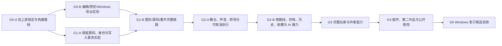

# 开发计划

更新：2026-10-07。当前工作单元为 **G0-A：准备与上游基线**。项目目标包含播放器、人工导演编辑器、AI/源码协作和 Windows 离线交付；准备完成不表示这些能力已实现。

本计划是对私有输入的工程拆解，不代替原始约束。两份输入保存在本地 `docs/private/`，不得提交 Git；公开文档仅保留自主归纳的需求、决策与验证结果。用户本次已授权创建开源 Git 仓库、安装必要环境、调用工具和使用 computer use。公开仓库授权不扩展到商业素材、密钥、个人文件或未经授权的第三方内容。

## 工作顺序与关口

关口是证据集合，不固定开发轮数。独立的原作对标、许可证、Windows 构建、文档和异常回归贯穿各轮；性能测量从能运行的上游开始。任一关口发现结构性问题，允许拆出有明确停止条件的实验，保留已有成果。

| 关口 | 达成范围 | 尚不能据此宣称 |
| --- | --- | --- |
| G0 | 锁定两套候选代码，复现构建/运行或定位具体阻碍，形成改造证据 | 导演模式、完整 Windows 游戏或完整原作对标已完成 |
| G1 | 一个小场景的人工修改、源码修改、保存重开形成闭环；未知内容和身份不丢失 | 全部编辑控件、AI 创作或播放器全功能通过 |
| G2 | 有动作/转场/分支的可玩小样片，人工与 AI 接力，关键中断与恢复验证 | 小样片即完整框架 |
| G3 | 需求登记的传统玩家能力和完整作者操作逐项落地 | 公共扩展、第二作品和发行验收自动通过 |
| G4 | 真实插件、第二作品、新作者文档、可测性能与构建流程 | 所有原作细节或全部 Windows 环境均已核验 |
| G5 | 已声明 Windows 范围的需求、对标、自动与人工证据汇总 | 任何未测试平台、未知原作行为或待审素材已支持 |

## 当前单元：G0-A

目标是得到可接续的实测底座。关联 U-01/U-05/U-06/U-12、B-01/B-03/B-06/B-08、N-03、N-14、N-15、N-18、N-19（N 系列见需求账本）。

前置条件是授权目录、两份输入和可取得的上游代码。先只读检查文件、Git、工具及用户修改边界；再锁定 WebGAL 与 Terre 的提交、锁文件、运行时和包管理器。当前候选不是最终架构承诺，不能用未修改的构建结果代替改造可行性结论。

| 项目 | 本轮安排 |
| --- | --- |
| 修改范围 | 项目入口、忽略规则、来源锁定、可重放准备脚本、开发与验收账本；必要的环境安装；隔离的上游基线工作区 |
| 本轮不纳入 | 全面换框架、批量升级依赖、独立重写执行器、正式素材制作、承诺未测平台 |
| 核心风险 | 两套上游版本配套、网络与包管理器、Windows 壳/分发依赖、仅构建成功却无法联调 |
| 验证 | 来源与提交可重查；锁文件安装；两上游构建退出码；可启动性/端口/日志；本地私有输入不在待提交集合 |
| 退出判据 | 每项实际结果落盘；至少形成真实基线或可复现失败诊断；未运行 GUI/未导出等缺口逐项登记；下一条命令明确 |
| 失败回退 | 保留失败日志与锁定版本；只回退本任务引入的可逆改动；不重置用户工作；不删除锁文件以掩盖失败 |
| 下一单元 | 条件允许时执行 G0-B；可独立并行 G1-A 的有限文本/事务实验 |

“准备好了”仅表示工作区、追踪、路线和可复现入口就绪。G0 的实际状态以 [PROJECT_STATUS.md](PROJECT_STATUS.md)、[ENGINE_EVALUATION.md](ENGINE_EVALUATION.md) 和测试证据为准；此计划不会预先授予通过状态。

## 后续工作单元

| 单元 | 目标、依赖及关联需求 | 修改边界与主要风险 | 验证与退出 | 回退 |
| --- | --- | --- | --- | --- |
| G0-B | 基于 G0-A 原版运行，亲自完成最小场景、原生图形/源码切换、预览、保存重开和首个 Windows 导出。U-01、B-01—B-04 | 先沿用上游链路；不预设桌面壳。风险为导出服务/下载依赖、编辑器与引擎不配套 | 保存操作、进程与产物日志；脱离开发服务器启动。构建、GUI、离线启动分别记录；失败可定位而不虚报 | 原版锁定 checkout 可重建；样例放单独作品；保留导出诊断 |
| G1-A | 依赖上游语法检查；证明权威源码局部写回、ID、文本修订、外部版本校验。S-01/S-03—S-05/S-07/S-08、E-17、D-04 | 有限场景实验与可重用最小模块；不引入第二剧情执行器。风险为未知语法、注释格式、身份歧义、草稿覆盖 | AT-02/03/04/23 的解析与事务子测试；插入/移动/复制/重排/文本修订；冲突不写盘、失败保留原文。UI 部分仍独立未验收 | 原文件快照、差异输出、原子替换与失败前内容；不做不可逆格式迁移 |
| G1-B | 依赖 G0-B 与 G1-A；将一条人工→源码→人工→重开流程接到 Terre 和实际预览。E-01—E-06/E-11—E-13/E-16/E-17、S-02/S-09、D-05 | 当前段最小控件、源范围和有效版本；不一次做完所有导演 UI。风险为 IME 抢键、继承来源、中段预览只跳行 | AT-01/02/03/04/06/21/22/23 的实际 UI 子场景。证实未应用草稿标识、持久化与预览隔离后进入 G2 | 功能开关或小补丁拆除；作品源码始终可由原生方式打开；恢复草稿单独保存 |
| G2-A | 依赖可靠编辑链路；两名角色的差分/站位/轻跳/平移，声音和雨雪，直接/淡入淡出/黑场/交叉淡化。V-01—V-07、T-01—T-04、P-02/P-03/P-12、E-07—E-10/E-18 | 统一时钟、等待与取消契约、资源准备和终态；不同时重写全部存档。风险为重复回调、偏移累积、旧人物闪现 | AT-05/07/08/09（T-01—04）/10/12/13；连续重播、菜单、快进与资源失败均有确定终态；录制动态证据 | 单元功能可停用；回到稳定场景快照；保留资源失败与取消任务日志 |
| G2-B | 依赖 G2-A；两条路线、真实存读档、历史/收藏，AI 查询/校验/局部修改。P-05—P-08、D-01—D-05、I-01—I-10、A-01—A-06/A-08 | 优先稳定检查点存档；源码/收藏/语音使用身份与修订。风险为旧档清收藏、回调跨会话、伪造模拟结论 | AT-11/14/15/16/17/18/23/24/25/27；真实退出重启、人工与独立 AI 接力、导出包恢复。小样片只能声明对应通过项 | 保留原始存档备份；版本不兼容明确拒绝；预览 profile 隔离；AI 写入带版本 |
| G3-A | 依赖 G2；完善标题菜单、输入/设置、流程图、鉴赏/回想、可访问性及数据管理。P-01/P-04/P-09—P-17、D-02/D-03 | 完整玩家流程；不以未来插件代替必做功能。风险为剧透、解锁污染、音轨争用 | AT-19/20/28/31/33 与逐项补充测试；原作差异进入对标表；菜单、恢复和声音须真实观察 | 可恢复配置与独立回想 profile；数据删除范围明确确认；保留旧格式 |
| G3-B | 依赖 G2/G3-A；完善全文/结构编辑、局部时间轴、素材批处理、全部转场与演出模板。E-02/E-09/E-14/E-15/E-18—E-20、T-05—T-10、V-08—V-10、A-07/A-09/A-10 | 共享定义影响分析、高级源码边界、参数帮助；不把任意代码承诺转为控件 | AT-07/09/19/25/30，补参数单位、批改预览、引用安全删除测试。所有完整版本转场有独立证据 | 事务撤销、实例覆盖、共享预设版本；失败仅撤回该次操作 |
| G4-A | 依赖稳定命令/状态契约；插件登记、管理和真实自定义效果。S-06、X-01—X-08 | 可信本地插件随作品构建；不宣称任意代码沙箱。风险为版本/依赖冲突、禁用后的坏档 | AT-26；安装/配置/停用/移除、AI 参数一致性、存读档、快进/销毁和打包均真实运行 | 锁定插件与依赖；缺插件阻止不安全恢复，提供诊断；恢复安装前清单 |
| G4-B | 依赖 G3 与 G4-A；风格不同的第二作品、教程、性能和发布预检。B-05—B-09、A-09/A-10、I-08、N-14 | 模板/主题/config 驱动；不修改核心来适配第二作品。风险为私有路径、资源授权、热缓存掩盖启动成本 | AT-28/29/30/32/34；干净环境与可搬迁工程；实际 CPU/GPU/资源规模、加载/卡顿/内存趋势；新作者按文档操作 | 第二作品独立目录；保留基准数据；性能优化按模块撤回，目标变化需原因 |
| G5 | 依赖所有必做项的实现证据、可得原作信息和合法可发素材；Windows 发行候选 | 仅回归和修复，不在候选轮混入重大架构迁移。风险为未测边界、环境覆盖与审美未确认 | AT-01—34 及子项结果完整；实际离线普通用户包、重启恢复、异常写盘、发行检查；待人工/未知明确保留 | 候选构建可追溯；不覆盖旧发行/存档；回到上个可用构建并附兼容说明 |

## 先验证的设计问题

| 问题 | 暂定处理 | 需要的证据 / 决定时间 |
| --- | --- | --- |
| 权威作品数据 | 优先保留原生剧本；元数据用于身份、资源备注、编辑组织。缓存可重建 | G1-A 往返、插入/复制/移动与外部修改测试后记录存储方案 |
| 身份载体 | 比较原生兼容注释和附加索引；不能只用行号或文本相等判断 | 上游解析/格式化行为和歧义复现；未决定前不推出兼容存档协议 |
| 转场中存档 | 优先最近稳定剧情检查点并告知实际保存位置；排队策略只在实验证明可用时采用 | G2-A/B 中断和退出测试；明确副作用只执行一次 |
| 中段预览 | 用路线/初始状态/检查点恢复；与正式玩家 profile 分离 | AT-21 以及依赖前文变量/舞台的场景 |
| 设计坐标 | 以明确设计分辨率与等比显示为默认；具体坐标原点/单位待上游核查 | G1-B 舞台拖动与多视口比对 |
| 扩展信任 | 作者审核的本地代码随构建打包；公共 manifest 是信息契约 | AT-26 生命周期/失效测试；不当作隔离沙箱 |
| 原作版本 | 用户已确认 Steam 中文版；具体 build、补丁及平台集成行为仍待核验 | 官方资料与合法实际观察；不阻塞基本工程，阻塞完全对标声明 |
| 正式素材 | 开发可用清楚标识的原创占位，发行素材与授权单独验收 | 资源清单、可见检查、来源证据、用户审美复核 |
| 支持环境 | 记录实际 Windows 机器与壳；不推断最低配置或 macOS/Android 支持 | G0-B/AT-27/28/30，后续平台单独验证 |

## 测试与调整原则

- 产品需求状态、测试结果、上游能力和参考事实分别记录；构建成功不修改产品验收状态。
- 先做会改变架构结论的往返、身份、预览恢复、任务取消、存档和导出实验，再扩大界面。每轮至少交付一个可操作或可重放的结果。
- 单元测试覆盖文本补丁/参数/状态；集成测试接真实执行与持久化；UI/声音/Windows 成品另行验证。静态画面不充当动态转场或声音证据。
- 性能先测基线，再写目标；60 fps、300 ms 参数反馈、1 s 缓存跳段暂属待测建议。每次测量同时注明机器、资源规模和分位/趋势，不能事后静默放宽标准。
- 修改测试预期必须有需求依据；失败进入问题记录，不能删断言或扩大忽略来制造通过。
- 每轮结束更新状态、测试证据和交接。重新接续先核查 Git/文件/环境/进程；不依赖旧聊天自称完成。

## 当前待补信息

用户不需要重复确认已给出的产品方向、开源授权和 Steam 中文版参考。后续可能需要核查具体 build/补丁信息，以及正式素材/美术体验的判断。此前可完成工程基线、源码/编辑链路和通用玩家能力；这些信息不足不构成全面停工理由。
