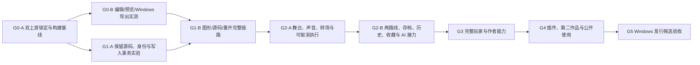

# 开发计划

更新：2026-10-09，版本 `0.0.12`。当前接入 **有限静态背景转场的时长与连续执行编辑**，沿用等待与执行顺序说明、四类局部新增、已有对白集中编辑和静态主图保存门禁；代码契约与实际构建、GUI 验收分别登记。下一作者单元优先检查静态立绘的同类转场路径，`setAnimation` 另行界定目标、资源及并行契约；历史/流程图恢复及真实 IME 矩阵继续分开推进。G0-B、完整 G1 和 G2 均未整体验收；项目目标仍包含完整播放器、导演编辑器、AI/源码协作和 Windows 离线交付。

本计划是对私有输入的工程拆解，不代替原始约束。两份输入保存在本地 `docs/private/`，不得提交 Git；公开文档仅保留自主归纳的需求、决策与验证结果。用户本次已授权创建开源 Git 仓库、安装必要环境、调用工具和使用 computer use。公开仓库授权不扩展到商业素材、密钥、个人文件或未经授权的第三方内容。

## 工作顺序与关口

关口是证据集合，不固定开发轮数。独立的原作对标、许可证、Windows 构建、文档和异常回归贯穿各轮；性能测量从能运行的上游开始。任一关口发现结构性问题，允许拆出有明确停止条件的实验，保留已有成果。

| 关口 | 达成范围 | 尚不能据此宣称 |
| --- | --- | --- |
| G0 | 锁定两套候选代码，复现构建/运行或定位具体阻碍，形成改造证据 | 导演模式、完整 Windows 游戏或完整原作对标已完成 |
| G1 | 一个小场景的人工修改、源码修改、保存重开形成闭环；未知内容和身份不丢失 | 全部编辑控件、AI 创作或播放器全功能通过 |
| G2 | 有动作/转场/分支的可玩小样片，人工与 AI 接力，关键中断与恢复验证 | 小样片即完整框架 |
| G3 | 需求登记的传统玩家能力和完整作者操作逐项落地 | 公共扩展、第二作品和发行验收自动通过 |
| G4 | 真实插件、第二作品、新作者文档、可测性能与构建流程 | 所有原作细节或全部 Windows 环境均已核验 |
| G5 | 已声明 Windows 范围的需求、对标、自动与人工证据汇总 | 任何未测试平台、未知原作行为或待审素材已支持 |

## 已完成的起步单元：G0-A

目标是得到可接续的实测底座。关联 U-01/U-05/U-06/U-12、B-01/B-03/B-06/B-08、N-03、N-14、N-15、N-18、N-19（N 系列见需求账本）。

前置条件是授权目录、两份输入和可取得的上游代码。先只读检查文件、Git、工具及用户修改边界；再锁定 WebGAL 与 Terre 的提交、锁文件、运行时和包管理器。当前候选不是最终架构承诺，不能用未修改的构建结果代替改造可行性结论。

| 项目 | 本轮安排 |
| --- | --- |
| 修改范围 | 项目入口、忽略规则、来源锁定、可重放准备脚本、开发与验收账本；必要的环境安装；隔离的上游基线工作区 |
| 本轮不纳入 | 全面换框架、批量升级依赖、独立重写执行器、正式素材制作、承诺未测平台 |
| 核心风险 | 两套上游版本配套、网络与包管理器、Windows 壳/分发依赖、仅构建成功却无法联调 |
| 验证 | 来源与提交可重查；锁文件安装；两上游构建退出码；可启动性/端口/日志；本地私有输入不在待提交集合 |
| 退出判据 | 每项实际结果落盘；至少形成真实基线或可复现失败诊断；未运行 GUI/未导出等缺口逐项登记；下一条命令明确 |
| 失败回退 | 保留失败日志与锁定版本；只回退本任务引入的可逆改动；不重置用户工作；不删除锁文件以掩盖失败 |
| 下一单元 | 条件允许时执行 G0-B；可独立并行 G1-A 的有限文本/事务实验 |

“准备好了”仅表示工作区、追踪、路线和可复现入口就绪。G0 的实际状态以 [PROJECT_STATUS.md](PROJECT_STATUS.md)、[ENGINE_EVALUATION.md](ENGINE_EVALUATION.md) 和测试证据为准；此计划不会预先授予通过状态。

## 第二至十二轮进度与下一单元

`0.0.2` 已完成隔离启动、后端 ESM 测试适配、带版本的场景落盘、图形/源码共享草稿、冲突保留及可重放补丁。简单场景实际保存重开成功，详细记录见 [第二轮证据](evidence/2026-10-07-round2.md)。这是一项接入实验，G0-B 与 G1-A/G1-B 的剩余条件仍生效。

`0.0.3` 已接入锁定核心的语法/身份诊断、只读高级块、正式图形编辑路径的持久 ID 与局部 token 写回；复制新 ID、移动保留 ID、错误草稿保留和修复保存已有真实 GUI 证据。Windows 原链路导出、原生库 ASAR 旁置和一槽正常退出重启读档也已通过本机子项。完整语言/插件校验、旧档迁移、全机断网和干净机器并未由这些结果自动通过，详见 [第三轮证据](evidence/2026-10-07-round3.md) 与 [Windows 证据](evidence/2026-10-07-windows-export.md)。

`0.0.4` 增加共享场景撤销/重做（100 步、2 MiB 增量，保存保留）、浏览器按工作区/路径/owner 隔离的持久恢复副本，以及保存前工作区身份校验。关闭标签后的副本需明确选择，旧 v1 session 不自动混入；这不等于项目文件系统崩溃恢复。原 1280×720 菜单裁切已定位并修复，三视口与共享模板新作品实际回归通过；259 项代码、最终构建和两子仓独立重放通过。实际 GUI 验证保存后撤销、多场景隔离及关闭标签后恢复，真实 Windows 中文候选输入与完整 AT 仍未验收。

`0.0.5` 已在锁定原运行时接入精确清单门禁、初始化前完整玩家值副本、等待普通/快速存储成功确认、版本/源码/指针预检后恢复，以及系统页备份导出与离线校验。清单绑定 projectId、Game_key、运行时兼容常量和全部已登记 game 文件原字节；每个 manifest 使用独立 namespace。旧键保留且不规范化；版本不明时只能使用隔离设置空间，不能借用旧档继续剧情。副本写入并读回核验失败时禁用存储，渲染入口仍继续。

第五轮代码回归覆盖备份完整性/范围/配额、普通/快速持久化写失败与队列、过时读取/namespace/epoch、备份成功前不开启原生存储，以及恢复预检与会话失效。其队列是存储适配的串行写入，不是演出期间排队保存或自动选择旧检查点。

`0.0.6` 沿原生执行器修复有限演出、菜单待推进、退场对象与音频的生命周期。已覆盖的有限演出未结束、退场临时对象未清理，或菜单中有待推进剧情时，普通/快档均拒绝生成混合状态快照；回到演出结束后的稳定对白再保存。当前没有存档请求排队，也不自动回退最近检查点。原生脚本样片生成器提供原创两角色、差分、动作、日夜转场/黑场、两分支与三类音频通道测试音，目标存在则拒绝覆盖。

第六轮 12 套代码入口 **301/301**：既有七入口现为 231 项，新增五入口 70 项，比第五轮的 220 项净增 81 项；真实补丁独立重放另计 18/18。浏览器实测双角色差分、菜单中等待结束仍停 R6-06 且拒存、返回只推进至 R6-07、稳定存档读回姿态、黑场清立绘与停止 BGM、两分支 route=1/2。音频 DOM 状态不能授予听觉质量通过；第六轮 Windows 新包结果独立记录。最终构建、现场步骤及替身范围见 [第六轮证据](evidence/2026-10-08-round6.md) 与 [TESTING.md](TESTING.md)。

`0.0.7` 增加有限对白导演面板：复用原生素材与参数控件，编辑紧邻对白前的安全舞台/声音命令，局部草稿一次应用、一次撤销、过期拒绝与预览隔离；不跨分支推断继承，不插入/删除/重排命令。运行时以当前对象身份跟踪静态主图 pending/ready/failed，普通和快速保存拒绝非就绪主图并保留旧槽；无同 URL 自动重试或全资源事务。

第七轮代码回归 646/646（运行时 339、作者 304、导演样片 3）。新原生样片保留 BOM/CRLF/注释，并包含故意不能解码的已封存图片。实际构建、GUI、导出与源码字节核验单独见 [第七轮证据](evidence/2026-10-08-round7.md)，不从替身或代码通过推导整体导演/Windows 验收。

`0.0.8` 在面板内增加背景、立绘、BGM 和 SE 四类完整素材命令，按添加顺序插入本句之前；只撤掉当前面板中新建行，保留已有行与等待顺序。新行分配新 ID，新增和已有修改仍一次应用到共享文档、一次撤销；待选素材与无效输入不能进入有效草稿。

第八轮前文来源参考按背景、BGM、位置/ID 立绘和最近效果音列出最近源码设置及行号，可经过简单对白；标签、分支、变量、未知参数和高级语句构成边界。明确关闭、尚无本场景来源、未知结果分别显示；它不求值变量或恢复运行时舞台，差分与音效不推断实际终态，当轮尚未提供来源跳转。

第八轮独立生成器保留 BOM/CRLF/作者注释，提供空局部设置的插入目标、后继对白和只读边界。新代码的现场保存、预览、Windows 验收与最终数量以 [TESTING](TESTING.md) 和 [当前状态](PROJECT_STATUS.md) 登记为准，不沿用第七轮通过结论。范围与操作见 [导演编辑](DIRECTOR_EDITING.md)。

`0.0.9` 增加只读的同场景来源定位。干净面板中的具体来源可关闭面板、展开并滚动聚焦原语句，随后返回原对白；明确关闭和具有具体命令的未知差分均可定位，没有具体来源的未知或未见状态不生成目标。操作不登记 ID、不编辑或保存、不执行剧情、不新增撤销历史。

来源与返回使用完整源码、历史代数、真实登记身份或精确原文位置，同时由图形编辑器绑定当前文档、路径、保存版本与生命周期。局部未应用草稿、待选素材、失焦缓冲错误、IME、过期文本、撤销重做 ABA、场景切换及已卸载回调均不能绕过边界；异步聚焦再次检查输入和文档状态。面板外部点击不再隐式取消，本轮原生选择器双击后保留新增草稿的路径已单独实测，范围见第九轮证据。

第九轮采用 Terre `0006` 增量补丁，保留前五份补丁原字节及两上游锁定 HEAD；不扩展运行时语义。代码回归、受控构建、补丁重放和真实 UI 结果在 [第九轮证据](evidence/2026-10-09-round9.md) 分别登记，不从纯函数或控件替身通过推导 GUI、Windows 或完整 AT-06 通过。同场景源码定位不等于跨分支或跨场景舞台继承。

后续按依赖推进：

1. 补图片失败的显式重试/超时策略、模型/视频和复杂 hold 演出、菜单/快进/会话切换组合，记录每种取消路径的终态与资源释放。静态主图保存门禁不等于全场景事务；现有同步回退不承诺撤销任意插件、外部 I/O 或全部音视频副作用。
2. 第十二轮在原生背景控件接入 `duration`、`enterDuration`、`exitDuration` 与布尔 `next` 的有限局部编辑，支持已有及本次新增静态图片；空值移除覆盖，严格整数校验，自定义效果和其他高级参数仍保守处理。下一作者单元优先检查静态立绘的同类转场路径，明确位置/ID、当前对象与后续退出的关系，并分别验收保存重开和正常播放；`setAnimation` 的目标、动画资源、并行/替换与跨句持续另作单元。更完整的动作/转场控件、时间轴与跨分支或跨场景继承独立实施，不以解释文案代替实际运行验收。等待仍不可新增、移除、移动或跨越；真实中文候选输入、组合键与撤销的完整 IME 矩阵、AI 接力和项目文件系统恢复仓继续后续推进。
3. 补多槽、历史/流程图 GUI、持久化故障、跨场景并发及异常关闭矩阵，并测量大作品全资源 hash 的时间、内存和快存频率影响。HTTP 不能枚举新增文件；本地 verify/封存核对完整文件集，`beforeunload` 不保证等待异步校验和落盘。
4. 第六轮 Windows 新包按独立证据记录；继续完成真实声音试听、DPI/全屏、全机离线/干净用户环境与异常退出验证。既有普通退出恢复成功不能授予新版本或完整发行通过；自带入口/衍生引擎的作品仍需各自升级和验收。
5. 精确版本之外的旧槽、已读、收藏和节点映射保持独立设计/迁移工作。保留旧作品及完整玩家备份，不能凭 nodeId 存在或相同台词自动转换。

副本文件校验不等于恢复导入，localforage 已开始的写入也不能取消。三方合并、全部资源事务和正式发行保持独立工作项。协议及限制见 [SAVE_COMPATIBILITY.md](SAVE_COMPATIBILITY.md)、[KNOWN_ISSUES.md](KNOWN_ISSUES.md)。

## 后续工作单元

| 单元 | 目标、依赖及关联需求 | 修改边界与主要风险 | 验证与退出 | 回退 |
| --- | --- | --- | --- | --- |
| G0-B | 基于 G0-A 原版运行，亲自完成最小场景、原生图形/源码切换、预览、保存重开和首个 Windows 导出。U-01、B-01—B-04 | 先沿用上游链路；不预设桌面壳。风险为导出服务/下载依赖、编辑器与引擎不配套 | 保存操作、进程与产物日志；脱离开发服务器启动。构建、GUI、离线启动分别记录；失败可定位而不虚报 | 原版锁定 checkout 可重建；样例放单独作品；保留导出诊断 |
| G1-A | 依赖上游语法检查；证明权威源码局部写回、ID、文本修订、外部版本校验。S-01/S-03—S-05/S-07/S-08、E-17、D-04 | 有限场景实验与可重用最小模块；不引入第二剧情执行器。风险为未知语法、注释格式、身份歧义、草稿覆盖 | AT-02/03/04/23 的解析与事务子测试；插入/移动/复制/重排/文本修订；冲突不写盘、失败保留原文。UI 部分仍独立未验收 | 原文件快照、差异输出、原子替换与失败前内容；不做不可逆格式迁移 |
| G1-B | 依赖 G0-B 与 G1-A；将一条人工→源码→人工→重开流程接到 Terre 和实际预览。E-01—E-06/E-11—E-13/E-16/E-17、S-02/S-09、D-05 | 当前段最小控件、源范围和有效版本；不一次做完所有导演 UI。风险为 IME 抢键、继承来源、中段预览只跳行 | AT-01/02/03/04/06/21/22/23 的实际 UI 子场景。证实未应用草稿标识、持久化与预览隔离后进入 G2 | 功能开关或小补丁拆除；作品源码始终可由原生方式打开；恢复草稿单独保存 |
| G2-A | 依赖可靠编辑链路；两名角色的差分/站位/轻跳/平移，声音和雨雪，直接/淡入淡出/黑场/交叉淡化。V-01—V-07、T-01—T-04、P-02/P-03/P-12、E-07—E-10/E-18 | 统一时钟、等待与取消契约、资源准备和终态；不同时重写全部存档。风险为重复回调、偏移累积、旧人物闪现 | AT-05/07/08/09（T-01—04）/10/12/13；连续重播、菜单、快进与资源失败均有确定终态；录制动态证据 | 单元功能可停用；回到稳定场景快照；保留资源失败与取消任务日志 |
| G2-B | 依赖 G2-A；两条路线、真实存读档、历史/收藏，AI 查询/校验/局部修改。P-05—P-08、D-01—D-05、I-01—I-10、A-01—A-06/A-08 | 稳定对白处存档，演出中明确拒绝；源码/收藏/语音使用身份与修订。风险为旧档清收藏、回调跨会话、伪造模拟结论 | AT-11/14/15/16/17/18/23/24/25/27；真实退出重启、人工与独立 AI 接力、导出包恢复。小样片只能声明对应通过项 | 保留原始存档备份；版本不兼容明确拒绝；预览 profile 隔离；AI 写入带版本 |
| G3-A | 依赖 G2；完善标题菜单、输入/设置、流程图、鉴赏/回想、可访问性及数据管理。P-01/P-04/P-09—P-17、D-02/D-03 | 完整玩家流程；不以未来插件代替必做功能。风险为剧透、解锁污染、音轨争用 | AT-19/20/28/31/33 与逐项补充测试；原作差异进入对标表；菜单、恢复和声音须真实观察 | 可恢复配置与独立回想 profile；数据删除范围明确确认；保留旧格式 |
| G3-B | 依赖 G2/G3-A；完善全文/结构编辑、局部时间轴、素材批处理、全部转场与演出模板。E-02/E-09/E-14/E-15/E-18—E-20、T-05—T-10、V-08—V-10、A-07/A-09/A-10 | 共享定义影响分析、高级源码边界、参数帮助；不把任意代码承诺转为控件 | AT-07/09/19/25/30，补参数单位、批改预览、引用安全删除测试。所有完整版本转场有独立证据 | 事务撤销、实例覆盖、共享预设版本；失败仅撤回该次操作 |
| G4-A | 依赖稳定命令/状态契约；插件登记、管理和真实自定义效果。S-06、X-01—X-08 | 可信本地插件随作品构建；不宣称任意代码沙箱。风险为版本/依赖冲突、禁用后的坏档 | AT-26；安装/配置/停用/移除、AI 参数一致性、存读档、快进/销毁和打包均真实运行 | 锁定插件与依赖；缺插件阻止不安全恢复，提供诊断；恢复安装前清单 |
| G4-B | 依赖 G3 与 G4-A；风格不同的第二作品、教程、性能和发布预检。B-05—B-09、A-09/A-10、I-08、N-14 | 模板/主题/config 驱动；不修改核心来适配第二作品。风险为私有路径、资源授权、热缓存掩盖启动成本 | AT-28/29/30/32/34；干净环境与可搬迁工程；实际 CPU/GPU/资源规模、加载/卡顿/内存趋势；新作者按文档操作 | 第二作品独立目录；保留基准数据；性能优化按模块撤回，目标变化需原因 |
| G5 | 依赖所有必做项的实现证据、可得原作信息和合法可发素材；Windows 发行候选 | 仅回归和修复，不在候选轮混入重大架构迁移。风险为未测边界、环境覆盖与审美未确认 | AT-01—34 及子项结果完整；实际离线普通用户包、重启恢复、异常写盘、发行检查；待人工/未知明确保留 | 候选构建可追溯；不覆盖旧发行/存档；回到上个可用构建并附兼容说明 |

## 先验证的设计问题

| 问题 | 暂定处理 | 需要的证据 / 决定时间 |
| --- | --- | --- |
| 权威作品数据 | 优先保留原生剧本；元数据用于身份、资源备注、编辑组织。缓存可重建 | G1-A 往返、插入/复制/移动与外部修改测试后记录存储方案 |
| 身份载体 | 当前编辑器采用原生尾注释 ID、兼容 legacy 独立标记；文本修订与身份分离 | 第三轮原生 parser/GUI 已验证有限范围；第五轮已接精确作品 manifest 绑定，仍不按行号、文本或 nodeId 猜跨版本迁移 |
| 转场中存档 | 0.0.6 对有限演出、退场临时对象及菜单待推进状态明确拒绝普通/快档；回到稳定对白后重试，不排队、不自动回退检查点 | 已有代码及浏览器子项；复杂 hold/插件、资源失败、全部退出恢复边界仍需 G2-A/B 验证 |
| 中段预览 | 用路线/初始状态/检查点恢复；与正式玩家 profile 分离 | AT-21 以及依赖前文变量/舞台的场景 |
| 设计坐标 | 以明确设计分辨率与等比显示为默认；具体坐标原点/单位待上游核查 | G1-B 舞台拖动与多视口比对 |
| 扩展信任 | 作者审核的本地代码随构建打包；公共 manifest 是信息契约 | AT-26 生命周期/失效测试；不当作隔离沙箱 |
| 原作版本 | 用户已确认 Steam 中文版；具体 build、补丁及平台集成行为仍待核验 | 官方资料与合法实际观察；不阻塞基本工程，阻塞完全对标声明 |
| 正式素材 | 开发可用清楚标识的原创占位，发行素材与授权单独验收 | 资源清单、可见检查、来源证据、用户审美复核 |
| 支持环境 | 记录实际 Windows 机器与壳；不推断最低配置或 macOS/Android 支持 | G0-B/AT-27/28/30，后续平台单独验证 |

## 测试与调整原则

- 产品需求状态、测试结果、上游能力和参考事实分别记录；构建成功不修改产品验收状态。
- 先做会改变架构结论的往返、身份、预览恢复、任务取消、存档和导出实验，再扩大界面。每轮至少交付一个可操作或可重放的结果。
- 单元测试覆盖文本补丁/参数/状态；集成测试接真实执行与持久化；UI/声音/Windows 成品另行验证。静态画面不充当动态转场或声音证据。
- 性能先测基线，再写目标；60 fps、300 ms 参数反馈、1 s 缓存跳段暂属待测建议。每次测量同时注明机器、资源规模和分位/趋势，不能事后静默放宽标准。
- 修改测试预期必须有需求依据；失败进入问题记录，不能删断言或扩大忽略来制造通过。
- 每轮结束更新状态、测试证据和交接。重新接续先核查 Git/文件/环境/进程；不依赖旧聊天自称完成。

## 当前待补信息

用户不需要重复确认已给出的产品方向、开源授权和 Steam 中文版参考。后续可能需要核查具体 build/补丁信息，以及正式素材/美术体验的判断。此前可完成工程基线、源码/编辑链路和通用玩家能力；这些信息不足不构成全面停工理由。

## 第十轮结构编辑增量

`0.0.10` 在原导演会话中加入已有 stage 删除与相邻整块交换。删除保留作者行内注释为只读行，所属旧独立身份标记一同去除；重排携带原块和身份，不为未登记命令补 ID。等待、独立注释、空行、对白、动态值与连续执行参数构成边界。影响确认绑定局部源文，失焦刷新后检查 IME、pending、错误输入和主文档历史，再一次应用。每次结构改动均用锁定原生 parser 核对剩余全部语句。

新 Terre `0007` 仅覆盖三个前端文件。代码、构建、重放、真实保存/重开和预览结果分别见 [第十轮证据](evidence/2026-10-09-round10.md)；不视为完整时间轴或新 Windows 包验收。

## 第十一轮：有限等待与执行说明

`0.0.11` 复用原生 Wait 控件与局部 token 写回，先校验原始输入，再编辑 0–2147483647 的整数毫秒和布尔 nobreak。next/continue/when、动态值和未知参数保持只读或收集边界。无语义变化不改原拼写、不登记身份；整组改回原值可恢复原字节，应用与共享撤销仍为单事务。

执行顺序直接依据锁定原生参数与隐式 ADD_NEXT_ARG_LIST，不累加重叠时长、不推测舞台终态。600 项本轮代码检查及八补丁独立重放通过；实际构建、浏览器、源码保存和未执行范围统一见 [第十一轮证据](evidence/2026-10-09-round11.md)。G0-B、完整 G1/G2 和发行验收继续保持未完成。

## 第十二轮：有限静态背景转场

`0.0.12` 复用原生 `ChangeBg` 与局部 token 写回，支持普通单行静态图片的入场回退 `duration`、入场时间 `enterDuration`、下次退场 `exitDuration` 与布尔 `next`。已有背景及面板本次新增图片共用同一契约。输入支持留空或 `0–2147483647` 的整数毫秒；空值移除配置，入场时间优先于入场回退，两项均空默认 `1500` 毫秒，下次退场留空也默认 `1500` 毫秒。下一次被替换或关闭才使用该背景的退场配置，当前旧背景保留它自己的配置；连续执行允许与后续演出重叠。

新转场区只接受三项时长、布尔 `next` 和原有校验允许的 `order`。CG 解锁名称/系列、自定义入退场、变换/缓动、连续组合、变量、重复或未知参数保持只读或原有收集边界；视频、GIF、模型和关闭背景不开放这些输入。原始缓冲在选图、切换连续执行和应用前校验，随后仍使用原生序列化与写回；无语义变化不改原字节，完整背景往返恢复原身份状态。取消、失焦/IME、过期全文/历史与整批撤销门禁继续生效。

代码回归覆盖原始输入与素材合流、留空/零值、等价与完整往返、作者注释及混合身份、原生长行折叠和只读边界。代码、受控构建、补丁重放、GUI、保存重开与正常播放结果分别见 [第十二轮证据](evidence/2026-10-09-round12.md)，不预授未运行验证，也不据此授予完整动作/转场、G2 或 Windows 发行验收。下一步优先评估静态立绘转场，随后独立推进 `setAnimation`。
